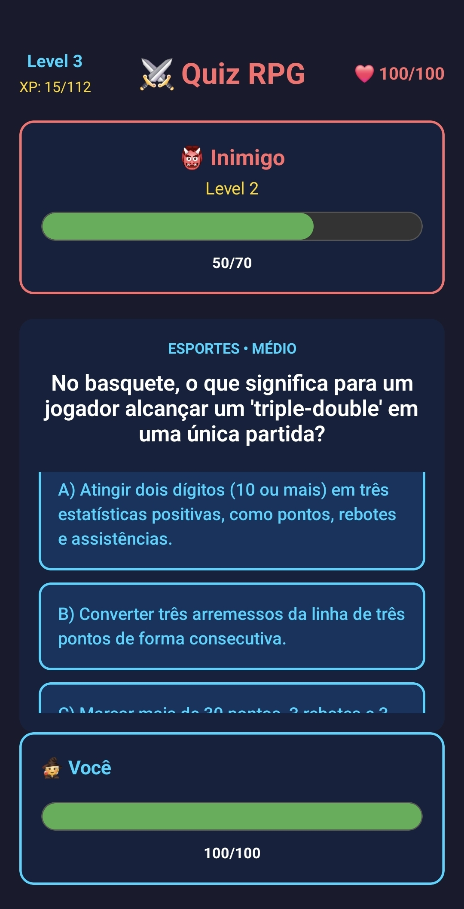

# 🎮 Quiz RPG

Um jogo de quiz educativo com mecânicas de RPG desenvolvido com React Native, Typescript e Expo. Responda perguntas corretamente para derrotar inimigos, ganhar XP e subir de nível!



## 📋 Índice

- [Sobre o Projeto](#sobre-o-projeto)
- [Funcionalidades](#funcionalidades)
- [Estrutura do Projeto](#estrutura-do-projeto)
- [Pré-requisitos](#pré-requisitos)
- [Instalação](#instalação)
- [Configuração da API Gemini](#configuração-da-api-gemini)
- [Como Usar](#como-usar)
- [Sistema de Jogo](#sistema-de-jogo)
- [Tecnologias Utilizadas](#tecnologias-utilizadas)
- [Troubleshooting](#troubleshooting)

## 🎯 Sobre o Projeto

Quiz RPG é um aplicativo educativo que transforma o aprendizado em uma aventura! Combine conhecimento com diversão em um sistema de batalha por turnos onde cada resposta correta causa dano ao inimigo e te aproxima do próximo nível.

### Por que este projeto?

- **Gamificação do aprendizado**: Torna o estudo mais envolvente
- **IA Generativa**: Usa Google Gemini para gerar perguntas ilimitadas
- **Sistema de fallback**: Funciona mesmo sem API configurada
- **Progressão RPG**: Sistema de níveis, XP e HP para motivação contínua

## ✨ Funcionalidades

### 🤖 Geração Inteligente de Perguntas
- Integração com **Google Gemini API** para perguntas dinâmicas
- Dificuldade adaptativa baseada no seu nível
- 8 categorias: Geografia, História, Ciência, Matemática, Literatura, Arte, Tecnologia, Esportes
- Sistema de fallback com 15 perguntas pré-definidas

### ⚔️ Mecânicas de RPG
- **Sistema de Níveis**: Suba de nível respondendo corretamente
- **HP (Pontos de Vida)**: Perde HP ao errar respostas
- **XP (Experiência)**: Ganhe XP para evoluir
- **Inimigos progressivos**: Cada inimigo derrotado gera um mais forte

### 🎨 Interface e Animações
- Animações suaves de dano e level up
- Barras de HP coloridas (verde → amarelo → vermelho)
- Feedback visual instantâneo
- Design dark theme moderno

### 🛡️ Sistema de Rate Limiting
- Respeita limites da API Gemini (2 requisições/minuto)
- Mudança automática para modo fallback em caso de erros
- Feedback visual durante espera

## 📁 Estrutura do Projeto

```
QuizRPG/
├── .expo/                 # Arquivos de cache do Expo
├── assets/               # Recursos estáticos (imagens, fontes)
├── node_modules/         # Dependências do projeto
├── .gitignore           # Arquivos ignorados pelo Git
├── app.json             # Configurações do Expo
├── App.tsx              # Componente principal do jogo
├── index.ts             # Ponto de entrada do app
├── package.json         # Dependências e scripts
├── package-lock.json    # Lock de dependências
└── tsconfig.json        # Configurações do TypeScript
```

### Arquivo Principal: App.tsx

O código está organizado em seções lógicas:

1. **Interfaces TypeScript**: Definições de tipos para Pergunta, Stats, ResultadoResposta
2. **Configuração da API**: Constantes e RateLimiter
3. **Banco de Perguntas Fallback**: 15 perguntas pré-definidas
4. **Componente Principal**: QuizRPG com toda a lógica do jogo
5. **Hooks e Estados**: Gerenciamento de estado com useState e useRef
6. **Funções de Geração**: gerarPerguntaComGemini() e gerarPerguntaFallback()
7. **Lógica de Jogo**: verificarResposta(), carregarPergunta(), novoInimigo()
8. **Animações**: Funções para animar dano, level up e HP
9. **Renderização UI**: Interface visual do jogo
10. **Estilos**: StyleSheet com todo o design

## 🔧 Pré-requisitos

Antes de começar, você precisa ter instalado:

- **Node.js** (versão 16 ou superior)
  - Download: https://nodejs.org/
  - Verifique: `node --version`

- **npm**
  - npm vem com Node.js

- **Expo Go** (para testar no celular)
  - [Android](https://play.google.com/store/apps/details?id=host.exp.exponent)
  - [iOS](https://apps.apple.com/app/expo-go/id982107779)

## 📥 Instalação

### 1. Clone o repositório

```bash
git clone https://github.com/seu-usuario/quiz-rpg.git
cd quiz-rpg
```

### 2. Instale as dependências

Com npm:
```bash
npm install
```

## 🔑 Configuração da API Gemini

### Opção 1: Com API Gemini (Perguntas Ilimitadas)

1. **Obtenha sua chave API gratuita**:
   - Acesse: https://aistudio.google.com/app/apikey
   - Faça login com sua conta Google
   - Clique em "Get API Key" → "Create API Key"
   - Copie sua chave

2. **Configure no código**:
   - Abra o arquivo `App.tsx`
   - Localize a linha (aproximadamente linha 42):
   ```typescript
   const GEMINI_API_KEY = ''; // Substitua pela sua chave
   ```
   - Cole sua chave:
   ```typescript
   const GEMINI_API_KEY = 'chave';
   ```

3. **Limites da API Gratuita**:
   - 60 requisições por minuto
   - 1.500 requisições por dia
   - O app usa rate limiting de 2 req/min para economia

### Opção 2: Sem API (Modo Fallback)

O app funciona perfeitamente sem API configurada! Ele usará as 15 perguntas pré-definidas em ordem aleatória.

- **Vantagens**: Sem necessidade de configuração, funciona offline
- **Desvantagens**: Perguntas limitadas, sem adaptação de dificuldade

## 🚀 Como Usar

### Iniciar o projeto

```bash
npx expo start
```

### Testar no celular

1. Instale o **Expo Go** no seu celular
2. Escaneie o QR code que aparecer no terminal
3. O app será carregado automaticamente

## 🎮 Sistema de Jogo

### Mecânicas Básicas

1. **Início**: Você começa no Level 1 com 100 HP
2. **Perguntas**: Responda perguntas de múltipla escolha
3. **Acerto**: Causa dano ao inimigo e ganha XP
4. **Erro**: Perde HP
5. **Level Up**: Ao ganhar XP suficiente, seu HP é restaurado
6. **Game Over**: Quando seu HP chega a 0

### Sistema de Dano e XP

| Dificuldade | Dano ao Inimigo | XP Ganho | Dano ao Errar |
|-------------|-----------------|----------|---------------|
| Fácil       | 5               | 10       | 5             |
| Médio       | 10              | 20       | 5             |
| Difícil     | 20              | 40       | 5             |

### Progressão de Inimigos

- **Inimigo Level 1**: 50 HP
- **Inimigo Level 2**: 60 HP
- **Inimigo Level 3**: 70 HP
- **Fórmula**: 50 + (level × 10) HP

### Sistema de Level Up

- **Level 1 → 2**: 50 XP necessário
- **Level 2 → 3**: 75 XP necessário
- **Fórmula**: XP necessário × 1.5 a cada nível
- **Benefício**: HP restaurado para 100

### Adaptação de Dificuldade

A dificuldade das perguntas aumenta com seu nível:

- **Level 1**: Perguntas fáceis
- **Level 2-3**: Perguntas médias
- **Level 4+**: Perguntas difíceis

## 🛠️ Tecnologias Utilizadas

### Core
- **React Native**: Framework para desenvolvimento mobile
- **TypeScript**: Tipagem estática para JavaScript
- **Expo**: Plataforma para desenvolvimento React Native

### APIs e Serviços
- **Google Gemini AI**: Geração de perguntas via IA
- **Fetch API**: Requisições HTTP

### Bibliotecas React Native
- **Animated**: Animações nativas
- **Dimensions**: Dimensões da tela
- **Alert**: Alertas nativos

### Conceitos Aplicados
- Hooks (useState, useEffect, useRef)
- Programação assíncrona (async/await)
- Rate limiting
- Error handling e fallback
- Animações imperativas
- TypeScript interfaces

## 🐛 Troubleshooting

### Problema: "Erro ao gerar pergunta"

**Causa**: Problemas com a API Gemini

**Solução**:
1. Verifique se a chave API está correta
2. Confirme se não ultrapassou os limites diários
3. O app mudará automaticamente para modo fallback

## 👨‍💻 Autor

Otávio Ferreira Dahlke

**Divirta-se jogando e aprendendo! 🎮📚**

Se tiver dúvidas, abra uma issue no GitHub ou entre em contato.